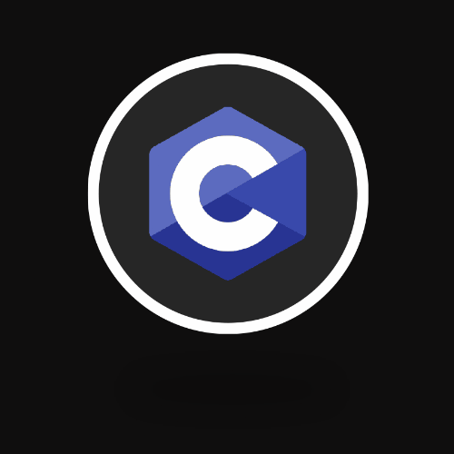
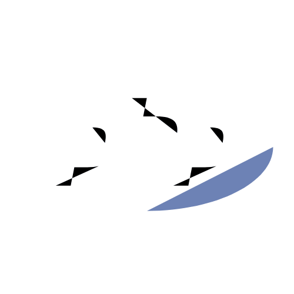
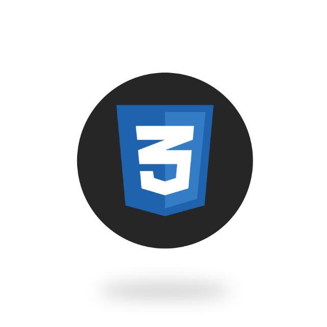

## About me

I'm a passionate self-taught **Python** developer from Hungary.

I'm also interested in these:

| DevOps  | Backend developer  | Business analytics  | IT  | Data Science | system administrator |
|---|---|---|---| --- | --- |

## Work experience

- Call me, and this section will not remain empty.

## Education

> ### **University of Szeged**
>> Computer Science Engineering (2019 - 2023)

## Language and tools

> excellent

           
  

> good

| Labview  	| Matlab  	| Matplotlib  	| Numpy  	| Pandas  	| Git  	|
|---	|---	|---	|--- |--- |--- |

## Contact me

  
  
  
  

## Other things

- My open-source projects you can find in my public repos.

